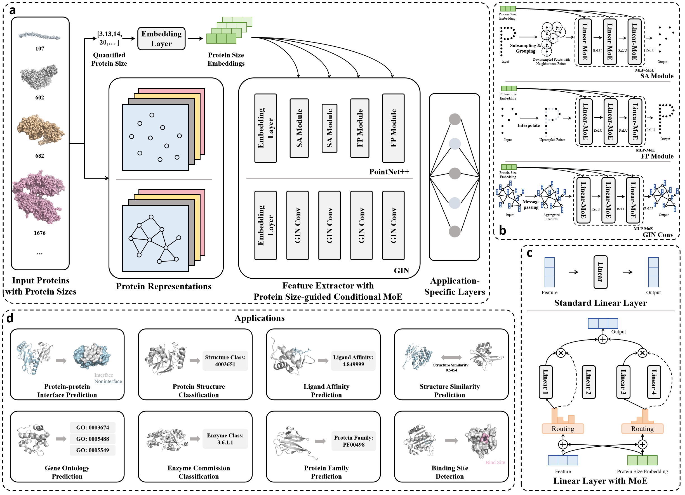

# ProSize-MoE


# 📚 Overview
This repository represents the official implementation of the paper: A Protein Size-guided Conditional Mixture-of-Experts for Improving Deep Learning on Protein Structures. In this paper, we propose a protein size-guided conditional mixture-of-experts for improving deep learning on protein structures. We plug this MoE module into two common existing base encoders for structural protein representation learning (graph and point cloud) to study its potential in improving protein property predictive performance. 



# 🔬 Installation

One can use `conda`, `mamba` or `pip` to download required packages. The main dependecies are:

```bash
proteinshake
pytorch
pyg
pytorch-lightning
hydra
```

An example for installing `ProteinShake_eval` with `mamba` (similar but faster than `conda`):

```bash
mamba create -n proteinshake
mamba activate proteinshake
mamba install pytorch pytorch-cuda=11.8 -c pytorch -c nvidia
mamba install pyg -c pyg
mamba install lightning
pip install hydra-core --upgrade
pip install proteinshake
pip install -e .
```

# 🤖  Model weights

The weights and logs for pre-trained models will be available after acceptance. 

# 🚀  Training

Train a graph neural network with our MoE for the Enzyme Class prediction task:
```bash
python experiments/train.py task=enzyme_class representation=graph
```


# ❀ Acknowledgments
In this project we use (parts of) the official implementations of the following works: 
- [ProteinShake](https://github.com/BorgwardtLab/proteinshake_models)
